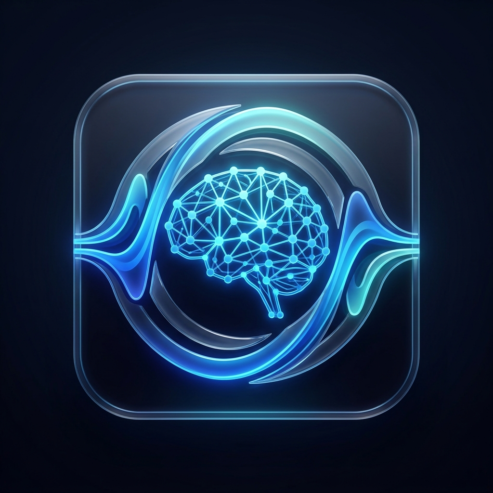

# 🎙️ Resemble Enhance Native & Portable

<p align="center">
  
</p>

### 高性能AI音声補正・鮮明化ツール (C++ Native & Python Portable)

Resemble Enhance Nativeは、[Resemble AI](https://github.com/resemble-ai/resemble-enhance)の強力なノイズ除去および音声鮮明化モデルを、高速なC++と洗練されたImGuiダッシュボードで実現したポータブルツールです。

---

## ✨ 主な機能

- **🚀 C++ Native Dashboard**: GLFW + ImGuiによる超軽量・高速なGUI。
- **🌐 多言語対応 (Bilingual)**: 日本語と英語の動的な切り替えに対応。
- **🧠 高精度AI音声補正**: 従来の近似処理を廃し、STFTによる正確な複素スペクトラム処理を実装したデノイザー。
- **🧹 強力なノイズ除去**: 背景の雑音をインテリジェントに除去。
- **📹 音声解析視認化**: オリジナルと処理後の波形をリアルタイムにプロット表示。
- **⚡ ゼロ・依存関係**: ONNX Runtimeを使用し、巨大なPyTorchなしでAI推論が可能。

---

## 🚀 使い方

1. **ダウンロード**: リポジトリをクローンまたはZIPでダウンロードします。
2. **起動**: `run.py` を実行するか、ビルド済みの `ResembleEnhance.exe` を起動します。
3. **準備**: 初回起動時は、必要なモデルとFFmpegの自動ダウンロードが行われます。
4. **補正**:
    - 入力フォルダ（またはファイル）をドラッグ＆ドロップ。
    - 出力フォルダを指定。
    - 「プレビュー」で結果を確認し、「一括補正開始」で実行。

---

## 🛠️ 開発者向けセットアップ

Python環境がある場合は、以下の手順で実行可能です。

```bash
# 依存関係のインストール
pip install -r requirements.txt

# アプリの起動
python run.py
```

---

## 📁 フォルダ構成

- `src/`: アプリケーションのソースコード
- `assets/`: アイコンや画像リソース
- `docs/`: 仕様書およびドキュメント
- `bin/`: FFmpegバイナリ（自動ダウンロード）
- `models/`: AIモデルデータ（自動ダウンロード）

---

## 📜 ライセンス

- **AIモデル**: Resemble AIによって配布されています。詳細は [official repository](https://github.com/resemble-ai/resemble-enhance) を参照してください。
- **ツール本体**: MIT License

---
© 2026 Antigravity Project
